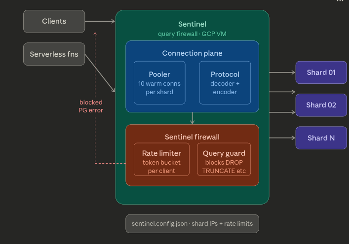

# Sentinel

A protocol-layer query firewall that intercepts PostgreSQL wire messages to enforce per-client rate limits and block destructive SQL patterns before they reach any shard.

Sentinel sits between your clients and your sharded Postgres instances. It speaks native PostgreSQL wire protocol — any client driver connects to it exactly as it would to a regular Postgres instance. Blocked queries receive a proper PG error response. Nothing reaches the shards that Sentinel does not allow through.

---

## Architecture



**Connection plane** — maintains a warm pool of 10 authenticated SSL connections per shard. Multiplexes client sessions across shard connections. Speaks raw PostgreSQL wire protocol on both sides via protocol decoder and encoder.

**Sentinel firewall** — intercepts every `Query (Q)` message before it reaches a shard. Applies two checks per query:

1. **Rate limiter** — token bucket per client IP. Excess queries get a `SQLSTATE 53400` error back. Configurable burst capacity and refill rate.
2. **Query guard** — blocks `DROP`, `TRUNCATE`, `ALTER TABLE`, and unguarded `DELETE` (no WHERE clause). Returns `SQLSTATE 42501`. Safe queries pass through unchanged.

Blocked queries never reach any shard. The client driver receives a valid PG error frame and has no way to distinguish Sentinel from a native Postgres instance.

---

## What Sentinel blocks

| Statement | Blocked |
|---|---|
| `DROP TABLE / DATABASE / INDEX / SCHEMA` | yes |
| `TRUNCATE` | yes |
| `ALTER TABLE` | yes |
| `DELETE FROM table` (no WHERE) | yes |
| `DELETE FROM table WHERE ...` | no |
| `SELECT`, `INSERT`, `UPDATE` | no |

---

## Prerequisites

- Node.js 18+
- `tsx` (installed automatically via npm)
- A host with SSL configured (see SSL section below)
- One or more Postgres instances reachable from the host

---

## Installation

```bash
git clone https://github.com/aryan55254/Senitel.git
cd Senitel
npm install
```

---

## Configuration

Copy the example config and fill in your shard details:

```bash
cp config_examples/sentinel.config.json sentinel.config.json
```

Edit `sentinel.config.json`:

```json
{
  "sentinel": {
    "port": 5432
  },
  "rateLimit": {
    "capacity": 20,
    "refillPerSec": 10
  },
  "shards": [
    {
      "id": "shard_01",
      "host": "your-shard-host",
      "port": 5432
    }
  ]
}
```

- `sentinel.port` — the port Sentinel listens on for incoming clients
- `rateLimit.capacity` — max burst queries per client before rate limiting kicks in
- `rateLimit.refillPerSec` — token refill rate per second per client
- `shards` — list of Postgres instances Sentinel will maintain connection pools to

---

## SSL

Sentinel must be hosted on a machine with SSL certificates configured. Clients connect to Sentinel over SSL and Sentinel connects to your Postgres shards over SSL.

**You are responsible for provisioning and managing your own certificates.** Sentinel reads `server-key.pem` and `server-cert.pem` from the project root. Place your certificates there before starting.

For a self-signed cert (testing only):

```bash
openssl req -x509 -newkey rsa:2048 \
  -keyout server-key.pem \
  -out server-cert.pem \
  -days 365 -nodes \
  -subj "/CN=localhost"
```

For production, use certificates from your cloud provider or Let's Encrypt.

Your Postgres shards must also have SSL enabled. If you are using a managed Postgres service (Supabase, Cloud SQL, RDS) this is enabled by default.

---

## Running

```bash
npm start
```

Sentinel will log pool initialization for each shard and begin accepting connections:

```
[Sentinel] Pool initialized → shard_01 at your-host:5432
[Sentinel] Listening on port 5432
[Sentinel] Guarding 1 shard(s)
```

---

## Connecting a client

Point any Postgres client at your Sentinel host and port:

```bash
psql "host=<sentinel-host> port=5432 dbname=<db> sslmode=require"
```

Or via connection string in any PG driver:

```
postgresql://user:password@<sentinel-host>:5432/dbname?sslmode=require
```

The client driver has no knowledge it is talking to Sentinel rather than a native Postgres instance.